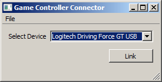

== Usage ==

This fork of the original LSL GameController App is built for Xbox controllers on Windows 10, using QT5 and DirectXTK. The program provides two streams, one for button-press events and another one for the axis values.

  * Make sure that your controller is plugged in an recognized by Windows.

  * Start the GameController app. You should see a window like the following.
>

  * Click the "Link" button to link the app to the lab network. If successful, the button should turn into "Unlink". If a firewall complains, allow the app to connect to the network.
  
  * Your Xbox devices will appear in the list, if you have more than one connected, select the one you want to use.

  * You should now have two streams on your lab network, one with name "NameofyourdeviceButtons" and type "Markers" and another one with name "NameofyourdeviceAxes" and type "Position". Note that you cannot close the app while it is linked. The app by default streams all possible axes that a controller might have, although only those axes that are actually present in the device in will deliver non-zero values. The button events are of the form: 

> A = 0

> B = 1

> X = 2

> Y = 3

> Dpad down: 4

> Dpad left: 5

> Dpad right: 6

> Dpad up: 7

> Left shoulder: 8

> Right shoulder: 9

> Start: 10

> L3: 11

> R3: 12

  * For subsequent uses you can save the desired settings from the GUI via File / Save Configuration. If you have multiple controllers connected and you frequently want to use the app with a specific one you might make a shortcut on the desktop that points to the app and appends to the Target field of the shortcut the snippet `-c name_of_config.cfg` to denote the name of the config file that should be loaded at startup.
